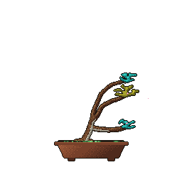

<h3 align="center"> hello ~ </h3>

---

<table align="right">
<tr>
<td align="center">

  
  
  
🌿 the bonsai above grows a little every day  
  

    
  
  

   

  
🎶 last playing  
  

  
</td>
</tr>
</table>
  
A full-stack developer i hope so and a little bit of game dev. 
  
- 💻 I use daily: `.go`, `.jsx/.tsx`
- 💬 `ping` me if **i can help you**!

Currently:
- ⚙️ improving backend architecture
- 🌱 learning more about infrastructure
- 🎮 experimenting with game development

Interested in: 
`backend` · `systems` · `open source` · `game dev`

 
  
---

<i>open to interesting projects</i> 
  
[[telegram](https://t.me/potatoff)] · [[email](mailto:kaptoshka@duck.com)]

